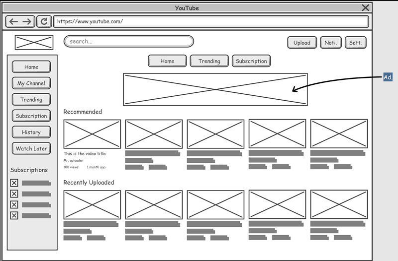
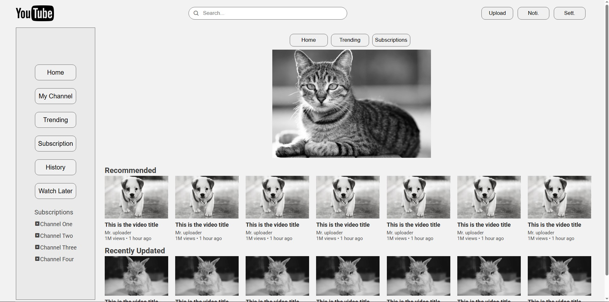

# Protótipo de Wireframe - YouTube

Este repositório contém um protótipo de interface baseado em um wireframe inspirado no YouTube.

📌 Este projeto foi desenvolvido como parte de um exercício da disciplina *Projeto e Desenvolvimento de Aplicações Para Web*.

## Instruções fornecidas pelo professor

Tendo em vista o Wireframe abaixo crie sua versão de protótipo fazendo uso de HTML e CSS.

## Captura de Tela

